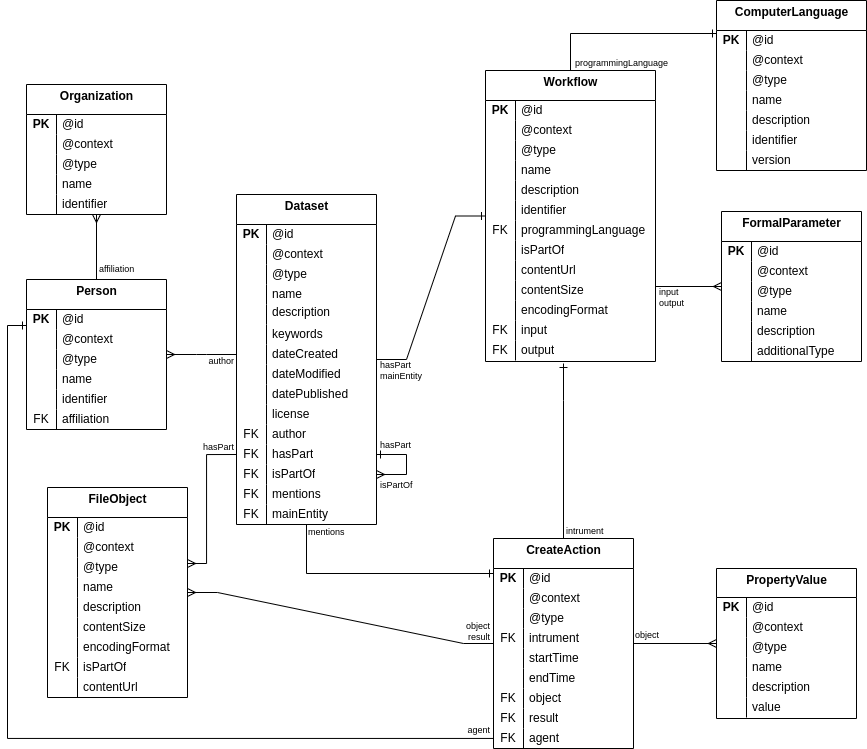

# Corda Data Schema for Crop wild relatives

Corda types and hooks for the [FAIR workflow platform](https://github.com/dnlbauer/FAIR-workflow-platform).

The data model closely resembles the RO-Crate data schema.
All digital objects are intended to also represent valid JSON-LD objects,
and therefore provide their own JSON-LD @context.

## Schema



## Hooks and Methods

- All Types extend `JsonLdType`, which patches objects before schema validation
to add a `@context` and `@type`. 
- The `Dataset` type deletes all of it's linked objects in `afterDelete` to clean
the repository if a dataset is removed.

### Type Methods

- `asNestedGraph` is a custom method on the `Dataset` type that returns a dataset and all linked objects in a single jsonld graph `{"@graph": [dataset, relatedObject1, relatedObject2, ...]}`
- `asGraph` is similar to `asNestedGraph`, but does not return objects linked by a nested Dataset (i.e. Files that are not part of the root dataset, but of a dataset that is included in that dataset)

## Build

Lifecycle hooks and type methods are written in Kotlin.
Gradle is used as a build system to create a "fat jar"
which can be used with Cordra (see [Cordra Java hooks](https://www.cordra.org/documentation/design/java-hooks-and-methods.html)).

## Deployment/Installation

The provided script [schemas/updateSchemas.py] can be used
to update a running Cordra instance with all types and the hook library.
It takes care of uploading all schemas and attaches the library jar file
to the dataset schema object:

To install, first build the library with `gradle build`:

```bash
gradle clean build
(...snip...)
BUILD SUCCESSFUL in 10s
7 actionable tasks: 7 execute
```

Then update Cordra using the script:

```bash
# install requirements for update script
python -m virtualenv venv
source venv/bin/activate
pip install -r schemas/requirements.txt

# run script
./schemas/updateSchemas.py https://example.com/cordra -u user -p password
Found schemas: ['Dataset.schema.json', 'FileObject.schema.json', 'PropertyValue.schema.json', 'FormalParameter.schema.json', 'Person.schema.json', 'Workflow.schema.json', 'Organization.schema.json', 'SoftwareApplication.schema.json', 'CreateAction.schema.json']
Patches for all schemas: [PosixPath('/home/dbauer/projects/destine_sdm/cordra-schema/schemas/AuthConfig.mergepatch.json')]
Processing  Dataset.schema.json ...
attach library /home/dbauer/projects/destine_sdm/cordra-schema/schemas/../lib/build/libs/lib.jar to schema Dataset
Schema known under id test/1052689464e38f5066d8. Updating...
Processing  FileObject.schema.json ...
Schema known under id test/d4c3554875c2b918da2d. Updating...
Processing  PropertyValue.schema.json ...
Schema known under id test/fcf8f76dda223261a8d8. Updating...
Processing  FormalParameter.schema.json ...
Schema known under id test/497954f5a6f4f66ce6f7. Updating...
Processing  Person.schema.json ...
Schema known under id test/8c41ae88467fe5bbad09. Updating...
Processing  Workflow.schema.json ...
Schema known under id test/d7a484140f5f9f7f5427. Updating...
Processing  Organization.schema.json ...
Schema known under id test/519255ae1f74ffc5ddd2. Updating...
Processing  SoftwareApplication.schema.json ...
Schema known under id test/ca05d5aed1fb0fa6b2c0. Updating...
Processing  CreateAction.schema.json ...
Schema known under id test/64b34dfa733ba2401298. Updating...
```

There is also an utility script [./schemas/deleteAllObjects.py]
which can be used to delete all objects from a running Cordra instance.

## LICENSE

Licensed under the [MIT](./LICENSE) License
